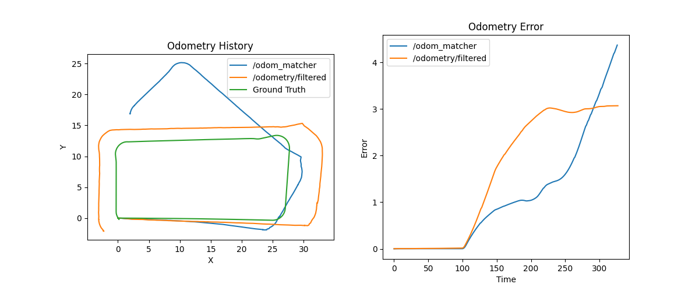

# odom_detective

This pkg subscribes to odometry sources and plot them in real-time using matplotlib. The `ground truth` needs to be bridge from Ignition Gazebo to ROS2.

## Usage
Compile and source the package:

```
ros2 run odom_detective detective_node
```

## Current Results

The Odometry History is OK, but the Odometry Error are WRONG
