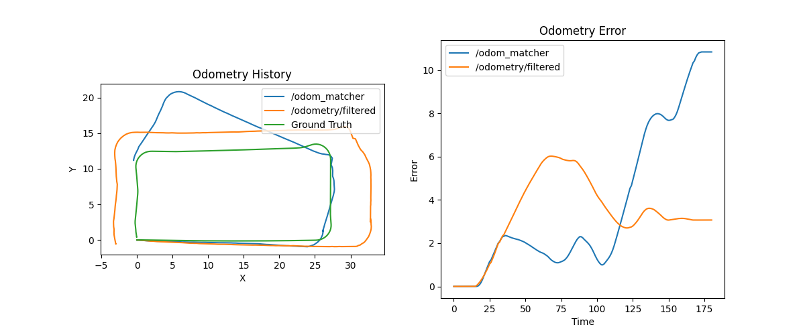

# odom_detective

This pkg subscribes to odometry sources and plot them in real-time using matplotlib. The `ground truth` needs to be bridge from Ignition Gazebo to ROS2.

## Usage
- Compile and source the package
- Use run or launch commands to start the node and analize your odometry data
```
ros2 run odom_detective detective_node --ros-args -p odom_topics:='["/odometry/filtered", "/odom_matcher"]'
ros2 launch odom_detective detective.launch.py odom_topics:='["/odometry/filtered", "/odom_matcher"]'
```

## Current Results

The Odometry History is OK, and the Odometry Error is OK


## Notes
- Is important to check the name of the Ignition world. The bridge is done by the launch file, but the world needs to be specified correctly.
```
ros2 run ros_gz_bridge parameter_bridge /world/demo_world/dynamic_pose/info@tf2_msgs/msg/TFMessage[ignition.msgs.Pose_V
```
- An alternative to this pkg can be find here [EVO](https://michaelgrupp.github.io/evo/), but uses rosbag and is not real-time